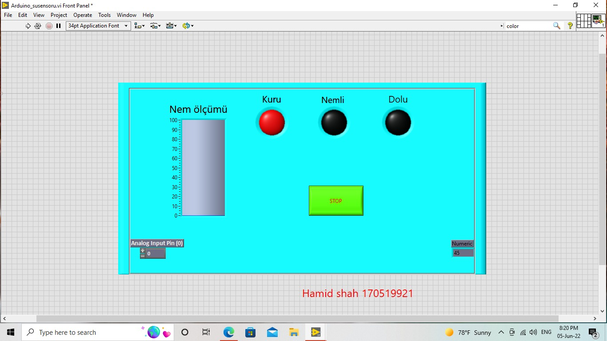
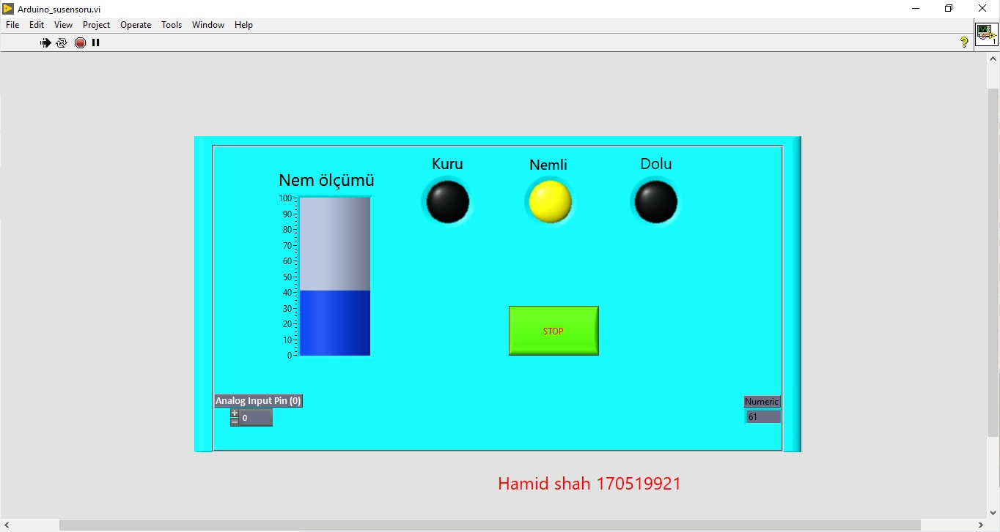
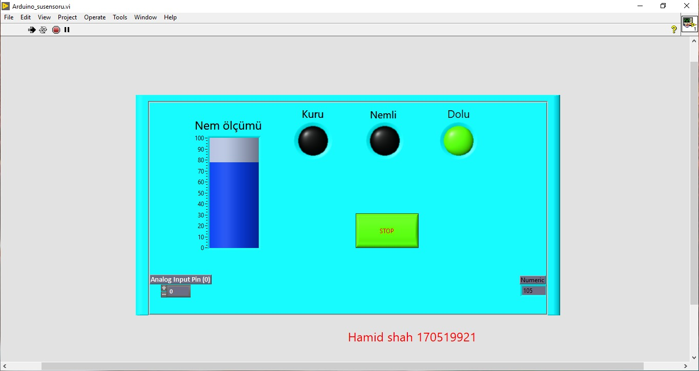
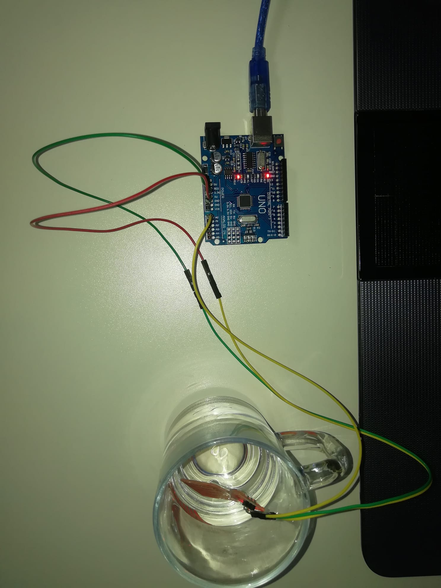
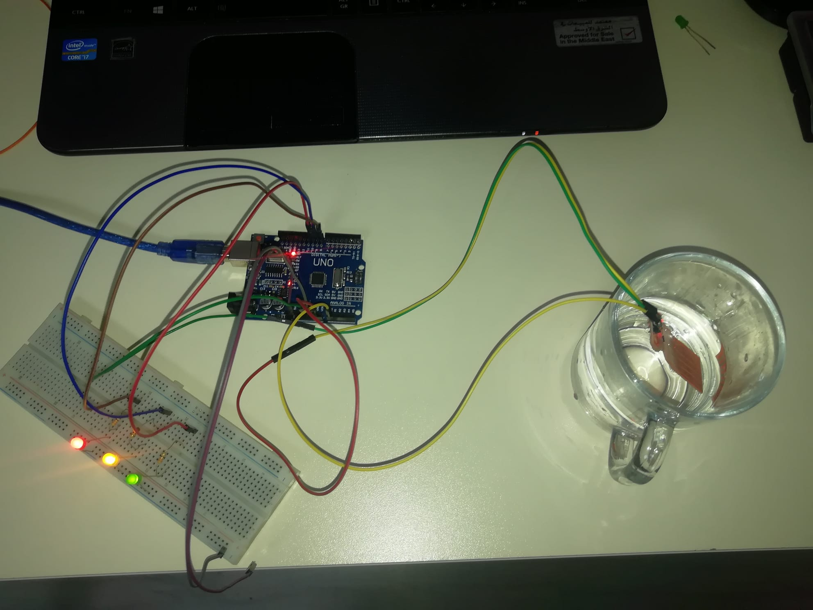

# Bitki Sulanma Sistemi

Bu proje, uzakta tutulan ve genellikle ulaşılamayan bitkilerin sulanması için geliştirilmiştir, Amin amacı, evde kimse yokken özel olarak nemi kontrol etmektir. Plnt vazo nemi 3 farklı renk Led ile gösterilebilir. Su seviyeleri;
1) Kuru veya daha az nem.(LED 1)
2) Orta nem.(LED 2)
3) Yüksek nem.(LED 3)

Konular Tablosu
-----------------

* [Hakkinda](#hakkinda)
* [LabView Devre Semasi](#labview-devre-semasi)
* [Arduino Devre Semasi](#arduino-devre-semasi)
* [Linkler](#linkler)

Hakkinda
------------

Küçük su pompası motoru yardımıyla otomatik olarak su dökülürken de kontrol edilebilir; bu durumda vazo içindeki toprağın nem seviyesi düşer ve LED 1 yanar duruma geçer; Opsiyonel olan ve bağlantı devresi burada gösterilmeyen bir motor sürücüsü (L298N) yardımı ile motor buna göre tetiklenebilir.
LED 2'yi "orta nem" düzeyine getirin ve LED3 yanana kadar açık durumda olacaktır. LED3, Yüksek nem seviyesini gösterir ve motor hemen kapalı duruma geçmelidir, bu yine motor sürücüsü yardımıyla yapılabilir.

LabView Devre Semasi
------------

  

Arduino Devre Semasi
------------

  
  *Baglanti Semasi :*
  
  
  
  
  
  

|                              |                              |
| :---------------------------:|:----------------------------:|
|   |   |

Linkler
------------

***[LabView Dosyasi](Arduino_susensoru.vi)***

***[Arduino Kodu](liquidsensor.ino)***
