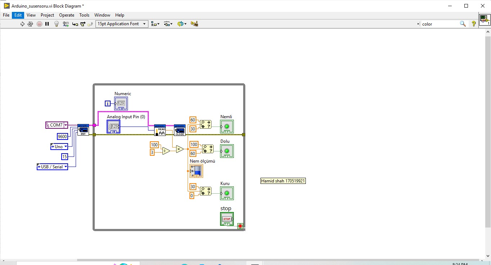

# Bitki Sulanma Sistemi

Bu proje, uzakta tutulan ve genellikle ulaşılamayan sulama tesisi için geliştirilmiştir. Amaç, evde kimse yokken özel olarak nemi kontrol etmektir. Bitki toprağının nemi 3 farklı Led rengi ile gösterilebilir.
Su seviyeleri;
1)Kuru veya daha az nem.(LED 1)
2)Orta nem.(LED 2)
3)Yüksek nem.(LED 3)

Konular Tablosu
-----------------

* [Hakkinda](#hakkinda)
* [LabView Devre Semasi](#labview-devre-semasi)
* [Arduino Devre Semasi](#arduino-devre-semasi)
* [Linkler](#linkler)

Hakkinda
------------

Ayrıca küçük su pompalama motoru yardımıyla suyu otomatik olarak dökerken kontrol edilebilir; bu durumda vazo içindeki toprağın nem seviyesi düşerse ve LED 1 yanıyorsa; motor, isteğe bağlı olan ve bağlantı devresi burada gösterilmeyen bir motor sürücüsü (L298N) yardımıyla çalıştırılabilir. "Orta nem seviyesine" (LED 2) geldikten sonra ve LED3 yanana kadar aktif durumda olacaktır. LED3, Yüksek nem seviyesini gösterir ve motor hemen kapalı duruma geçmelidir, bu yine motor sürücüsü yardımıyla yapılabilir. LED2, bitkinin sulanmaması için gecikme seviyesi olarak programlanabilen Orta nem seviyesidir.

LabView Devre Semasi
------------

  

Arduino Devre Semasi
------------

  
  *Baglanti Semasi :*
  
  
  
  
  
  

|                              |                              |
| :---------------------------:|:----------------------------:|
|   |   |

Linkler
------------

***[LabView Dosyasi](Arduino_susensoru.vi)***

***[Arduino Kodu](liquidsensor.ino)***
